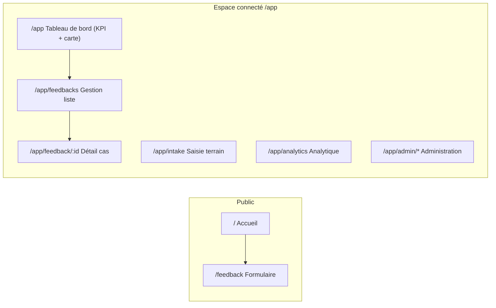

# Wireframes CFRM Hub

Document de **filaires (low-fidelity)** alignés sur l’application actuelle (`web/src`).  
Référence d’implémentation : routes dans `App.tsx`, pages citées ci-dessous.



---

## WF-01 — Formulaire de soumission de feedback

**Route :** `/feedback`  
**Page :** `PublicFeedbackPage.tsx`  
**Public cible :** personnes affectées, sans compte.

```
┌─────────────────────────────────────────────────────────────────────────────┐
│  [Logo CFRM]   Accueil · Soumettre un retour · (footer liens légaux)         │
├─────────────────────────────────────────────────────────────────────────────┤
│                                                                             │
│   Soumettre un retour                                                       │
│   ─────────────────                                                         │
│   Court texte d’intro (confidentialité, pas de compte requis)               │
│                                                                             │
│   ┌─────────────────────────────────────────────────────────────────────┐   │
│   │  CARTE / FORMULAIRE                                                  │   │
│   │                                                                      │   │
│   │  Canal / source *        [ Liste ▼ web | SMS simulé | WA | TG ]     │   │
│   │                                                                      │   │
│   │  Type de message *       [ Liste ▼ retour | alerte | plainte | … ]  │   │
│   │                                                                      │   │
│   │  Description détaillée *  ┌────────────────────────────────────────┐ │   │
│   │                           │ Zone multiligne (min 10 car., max 8k)  │ │   │
│   │                           │                                        │ │   │
│   │                           └────────────────────────────────────────┘ │   │
│   │                                                                      │   │
│   │  Localisation (Niger)                                                │   │
│   │    Village / localité    [________________]                          │   │
│   │    Région                [ Liste ▼ ]                                 │   │
│   │    [ Trouver sur la carte ]   Lat [____]  Lng [____]                 │   │
│   │    [ 📍 Utiliser ma position GPS ]                                   │   │
│   │                                                                      │   │
│   │  Contact (optionnel)     Nom [____]  Tél [____]  Courriel [____]    │   │
│   │                                                                      │   │
│   │  ▶ À propos de vous (replié par défaut)                              │   │
│   │      Tranche d’âge · Sexe · Tags diversité · Langue préférée         │   │
│   │                                                                      │   │
│   │  Pièces jointes (max 3, 10 Mo)   [ Parcourir… ]                      │   │
│   │                                                                      │   │
│   │  ┌─ Pré-classification indicative (client) ─────────────────────┐    │   │
│   │  │ Catégorie suggérée · Priorité estimée (si texte ≥ 10 car.)   │    │   │
│   │  └──────────────────────────────────────────────────────────────┘    │   │
│   │                                                                      │   │
│   │  [  Envoyer le message  ]                                            │   │
│   └─────────────────────────────────────────────────────────────────────┘   │
│                                                                             │
│   (État succès : titre « Message reçu », accusé, ID, boutons retour / nouveau)│
└─────────────────────────────────────────────────────────────────────────────┘
```

**Points clés produit :** pas d’authentification ; géoloc navigateur + géocodage village/région ; prévisualisation locale de la classification ; pièces jointes vers stockage sécurisé après création du feedback.

---

## WF-02 — Tableau de bord administrateur / superviseur

**Routes principales :** `/app` (KPI + carte, vue globale), `/app/feedbacks` (filtres + liste), `/app/analytics`, `/app/admin/*`.  
**Pages :** `DashboardPage.tsx`, `FeedbackManagementPage.tsx`, `AnalyticsPage.tsx`, `DashboardLayout.tsx`.

> *Superviseur / admin* : même coque **layout** (sidebar + barre du haut) ; les entrées **Admin** et **Analytique** dépendent des rôles (`validator`, `observer`, `admin`, etc.).

```
┌─────────────────────────────────────────────────────────────────────────────┐
│ SIDEBAR                          │ BARRE DU HAUT                              │
│  · Tableau de bord               │  [ Recherche globale feedbacks… ]  🌐 🔔   │
│  · Gestion des retours           │  [ Exporter CSV ] (si droit)   [Avatar]   │
│  · Saisie terrain (si rôle)      ├──────────────────────────────────────────┤
│  · Suivi des actions             │                                          │
│  · Analytique (si rôle)          │   TABLEAU DE BORD — KPI + carte           │
│  · ─── Admin (si admin)          │                                          │
│      Utilisateurs, Catégories,   │                                          │
│      Canaux, Points focaux,      │   ┌────┐ ┌────┐ ┌────┐ ┌────┐ ┌────┐ …   │
│      Audit                       │   │Tot.│ │Nouv│ │Cours│ │Crit│ │Doub│   │
│                                  │   └────┘ └────┘ └────┘ └────┘ └────┘    │
│                                  │   [ Bouton → Gestion des retours ]       │
│                                  │   + carte géographique                   │
│                                  │                                          │
└──────────────────────────────────┴──────────────────────────────────────────┘

─── Vue analytique dédiée : /app/analytics ───

┌─────────────────────────────────────────────────────────────────────────────┐
│  Analytique                                                                 │
│  Période [ 7j | 30j | 90j | Personnalisé ]   (dates si perso)              │
│                                                                             │
│  [ Graphique barres : volume hebdo + alertes ]   [ Camembert : types ]    │
│  [ Répartition par canal ]   [ Tableau catégories / priorités ]             │
└─────────────────────────────────────────────────────────────────────────────┘
```

**Points clés :** KPI et carte sans filtres (vue globale RLS) ; liste filtrée sur `/app/feedbacks` ; analytics = tendances longues ; admin = paramétrage métier.

---

## WF-03 — Interface de liste des cas (agent / gestionnaire)

**Route :** `/app/feedbacks` — page **`FeedbackManagementPage.tsx`**.  
**Alternatives rôle :** agent terrain : entrée **Mes envois** dans la barre latérale ; saisie via `/app/intake` (`FieldSubmitPage`).

```
┌─────────────────────────────────────────────────────────────────────────────┐
│  Filtres avancés (ligne 1–2, scroll horizontal sur mobile)                  │
│  [ Recherche texte ] [ Statut ▼ ] [ Priorité ▼ ] [ Canal ▼ ] [ Lieu ]       │
│  [ Date début ] [ Date fin ] [ Sexe ▼ ] [ Âge ▼ ]                           │
│  [ Boucle fermée ▼ ] [ ☐ Sensible seulement ] [ ☐ Assignés à moi ] …        │
│  [ Réinitialiser ]                                                          │
│                                                                             │
│  Onglets / chips rapides : Tous | Nouveaux | En validation | … (si actifs) │
│                                                                             │
│  ┌──────────────────────────────┬────────────────────────────────────────┐ │
│  │  CARTE (points géolocalisés) │  LISTE (tri colonnes ↑↓)               │ │
│  │                              │  ┌────────────────────────────────────┐  │ │
│  │     [    Carte interactive   │  │ Date │ Descr. │ Statut │ Priorité │  │ │
│  │          marqueurs pins      │  │      │ tronq. │ badge  │ efficace │  │ │
│  │    ]                         │  │  · SLA dépassé (indicateur visuel)  │  │ │
│  │                              │  │  · Doublon ? · Assignation (avatar) │  │ │
│  │                              │  └────────────────────────────────────┘  │ │
│  │                              │  Pagination  ‹ 1 2 3 … ›   Total : N    │ │
│  └──────────────────────────────┴────────────────────────────────────────┘ │
└─────────────────────────────────────────────────────────────────────────────┘
```

**Action principale :** clic sur une ligne → navigation vers **WF-04** (`/app/feedback/:id`).

---

## WF-04 — Vue détail d’un cas (gestionnaire)

**Route :** `/app/feedback/:id`  
**Page :** `FeedbackDetailPage.tsx`

```
┌─────────────────────────────────────────────────────────────────────────────┐
│  ← Retour tableau de bord     Fiche feedback [UUID court]                   │
├─────────────────────────────────────────────────────────────────────────────┤
│  COLONNE PRINCIPALE (lecture + édition selon droits)                        │
│                                                                             │
│  Badges : statut · priorité effective · canal · sensible (masqué si besoin) │
│  Catégorie suggérée vs validée · Type de message                            │
│                                                                             │
│  ┌─ Description complète ─────────────────────────────────────────────┐     │
│  │ Texte intégral + métadonnées (dates, géoloc, contact si présents) │     │
│  └────────────────────────────────────────────────────────────────────┘     │
│                                                                             │
│  Localisation : édition village/région / lat-lng (Niger) si autorisé      │
│                                                                             │
│  Pièces jointes : liste · ajout · suppression                              │
│                                                                             │
│  ┌─ Traitement (formulaire édition) ──────────────────────────────────┐   │
│  │ Statut [▼]  Catégorie [▼]  Priorité override [▼]  [ Enregistrer ]    │   │
│  └──────────────────────────────────────────────────────────────────────┘   │
│                                                                             │
│  Assignation : [ Liste staff ▼ ] [ Assigner ] · historique des changements │
│                                                                             │
│  Commentaires internes : liste · zone saisie · [ Publier ]                  │
│                                                                             │
│  Historique des statuts (timeline)                                          │
│                                                                             │
│  Doublons / fusion : recherche · propositions de fiches à lier               │
│                                                                             │
│  Fermeture de boucle communauté : texte + canal de notification [▼]         │
│                                                                             │
│  Signalement sensible : type [▼] · confirmation                              │
│                                                                             │
│  Actions liées : liste · lier / délier · créer action                       │
│                                                                             │
│  Points focaux (selon sensibilité)                                          │
└─────────────────────────────────────────────────────────────────────────────┘
```

**Points clés :** champs visibles / éditables selon `canEditFeedback`, `canCommentInternal`, `canFlagSensitive`, etc. ; contenu sensible masqué pour rôles non autorisés.

---

## Correspondance rapide

| WF   | Route / écran        | Fichier principal        |
|------|----------------------|--------------------------|
| WF-01 | `/feedback`          | `PublicFeedbackPage.tsx` |
| WF-02 | `/app`, `/app/analytics`, admin | `DashboardPage.tsx`, `AnalyticsPage.tsx`, `DashboardLayout.tsx` |
| WF-03 | `/app/feedbacks` | `FeedbackManagementPage.tsx` |
| WF-04 | `/app/feedback/:id`  | `FeedbackDetailPage.tsx` |

---

*Wireframes CFRM Hub — basés sur la structure UI du dépôt ; à utiliser pour spécifications UX, recettes et formations.*
